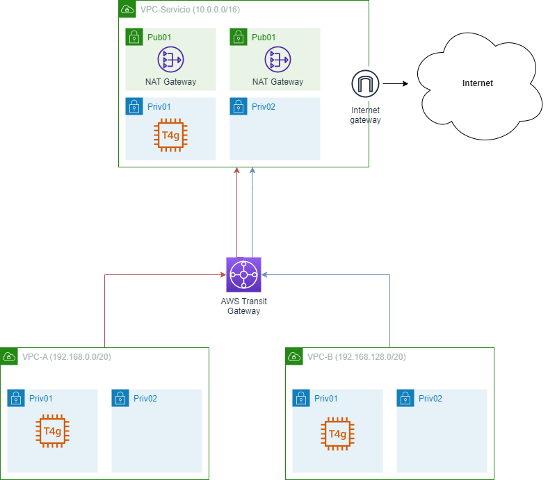

# AWS Transit Gateway
Este proyecto realiza la conexión de 3 VPCs mediante AWS Transit Gateway
VPC-Servicio. Permite la salida a Internet al resto de VPCs clientes
VPC-A y VPC-B. VPCs clientes que redirigen el tráfico saliente a Internet a través del Transit Gateway

