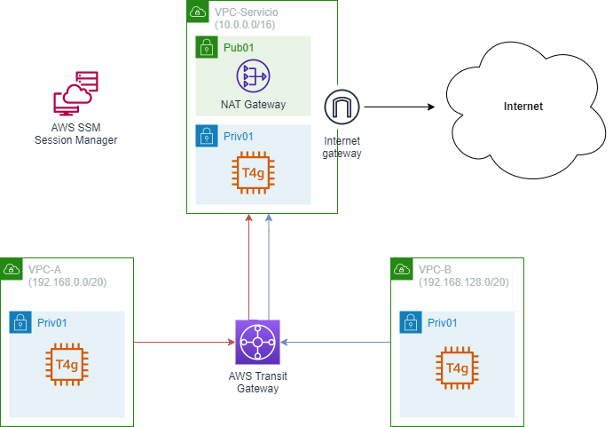

# **Despliegue de un servicio de salida a Internet centralizado mediante AWS Transit Gateway**

## **Objetivo**

**AWS Transit Gateway** es un servicio administrado que permite gestionar concentradores de tránsito de red que pueden utilizarse para la interconexión de VPCs y redes <em>on-premises</em>.

El objetivo de este repositorio es diseñar una infraestructura de red que permita definir una VPC de Salida llamada `VPC-Servicio`, que se utilizará para encaminar todo el tráfico hacia Internet desde el resto de las VPCs clientes: `VPC-A` y `VPC-B`.

El dispositivo Transit Gateway encaminará las solicitudes hacia Internet a través de la subred privada de la'VPC-Servicio`

Adicionalmente, el tráfico entre la `VPC-A` y `VPC-B` no debe permitirse.

## **Requerimientos**

* Una cuenta de AWS
* Un entorno Linux con acceso programático configurado a los servicios de AWS

## **Arquitectura propuesta**

* **AWS Transit Gateway** para el despliegue de un concentrador que interconecte selectivamente las diferentes VPCs y encamine el tráfico según las especificaciones del escenario
* **Amazon VPC** para la implementación de las VPCs del escenario

